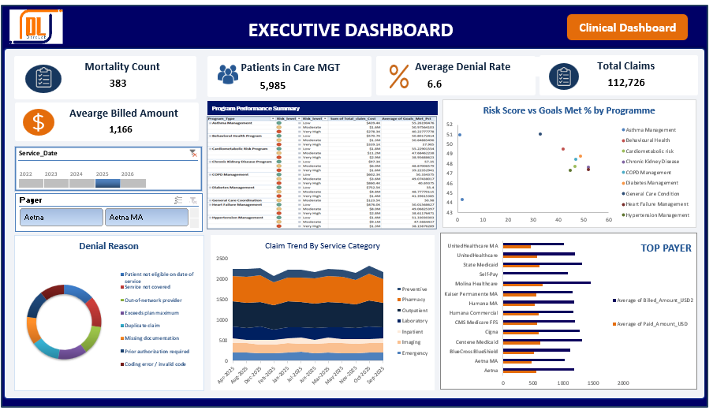

# Healthcare Claims, Care Management and Patient Outcomes Analysis 2022–2025
## Project Overview

This project analyzes approximately 400,000 healthcare records across five linked administrative and clinical datasets covering approximately 10,000 patients from 2022–2025.

The analysis explores patient demographics, medical conditions, healthcare claims, billing and denials, medication adherence, care management outcomes, and mortality.

The goal was to identify meaningful patterns and translate the findings into insights that could support patient care, resource allocation, and billing efficiency.

## Analytical Areas

The analysis covered 10 key areas:

1. **Patient Demographics** — Insurance distribution, claim volume, billed amounts, denial rates, and care management participation.

2. **Medical Conditions** — Frequency of ICD-10 diagnosis codes and Pareto analysis of the most common conditions.

3. **Claim & Admission Trends** — Monthly claim volume across different claim types from 2022–2025.

4. **Billing Performance by Payer** — Comparison of average billed and paid amounts across insurance payers.

5. **Denial Analysis** — Distribution of claim denial reasons and identification of major denial categories.

6. **Diagnostic Results** — Analysis of abnormal diagnostic results across test categories.

## Data & Data Preparation

The project used five linked administrative and clinical datasets covering approximately 10,000 patients and 400,000 records from 2022–2025.

Before analysis, the datasets were reviewed and cleaned to improve consistency and reliability. Key data preparation steps included:

- Standardising inconsistent gender labels such as "M", "Male", and "MALE"
- Converting mixed date formats into consistent date values
- Converting currency fields stored as text into numeric values
- Flagging impossible values, including invalid ages and adherence rates
- Handling missing values in categorical and numerical fields
- Identifying potential duplicate claims using patient, service date, and procedure information

8. **Medication & Adherence** — Prescription volume, medication adherence (PDC), and drug costs across drug classes.

9. **Care Management Outcomes** — Risk scores, goals met, and readmission rates across care management programmes.

10. **Mortality Analysis** — Leading causes of mortality, including patterns by age group and state.

11. **High-Risk & High-Cost Patients** — Identification of high-cost care management patients by programme and risk level.

## Tools & Techniques

- **Microsoft Excel** — Data cleaning, PivotTables, formulas, charts, dashboards, and interactive slicers.
- **Data Analysis** — Trend analysis, Pareto analysis, comparative analysis, correlation analysis, and KPI analysis.

  ## Key Findings

- **Claims & Denials:** Eligibility- and coverage-related denials accounted for 1,888 of 7,393 total denials (approximately 26%), highlighting an opportunity for stronger front-end eligibility and coverage verification.

- **Medication Adherence:** Average adherence across the top 10 drug classes ranged from 76.1% to 77.7%, consistently below the 80% target. The pattern suggests that the adherence gap was not isolated to one drug class.

- **Care Management:** Risk Score and Goals Met % showed a negative correlation of -0.76. Chronic Kidney Disease and Heart Failure Management had the highest average risk scores and lowest goal-completion rates.

- **Mortality:** Acute myocardial infarction (48 deaths) and end-stage renal disease (46 deaths) were the leading causes of mortality in the dataset.

- **High-Risk Patients:** Among the highest-cost care-management patients, those classified as "Very High" risk were concentrated toward the top of the cost distribution and lower goal attainment, identifying a clear group for targeted intervention.

## Dashboard Preview

The interactive Excel workbook brings the analysis together through dashboards and slicer-driven visuals, allowing users to explore healthcare claims, patient demographics, billing, medication adherence, care management, and mortality patterns.

### Executive Dashboard

